<div align="center">

[](https://github.com/carolinacherry)

</div>

# Hey, I'm Daniel 👋

**Director, Global AI/Copilot GTM Lead @ GitHub** | **Founder & CEO @ [Entopiq, Inc](https://entopiq.com)**

<div align="center">
<picture>
  <source media="(prefers-color-scheme: dark)" srcset="https://raw.githubusercontent.com/carolinacherry/carolinacherry/output/github-snake-dark.svg" />
  <source media="(prefers-color-scheme: light)" srcset="https://raw.githubusercontent.com/carolinacherry/carolinacherry/output/github-snake.svg" />
  
</picture>
</div>

<div align="center">
&nbsp;&nbsp;

</div>

Claude Code skills I ship. Copy a command — it drops the skill into your project's `.claude/skills/`:

```bash
npx shadcn add https://howborisusesclaudecode.com/r/boris.json    # /boris — 92 Claude Code tips
npx shadcn add https://howborisusesclaudecode.com/r/thariq.json   # /thariq — how to write skills
```

## 🚀 Building

<div align="center">
<a href="https://entopiq.com">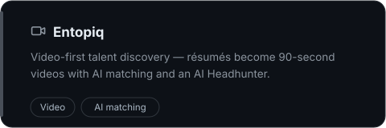</a>
<a href="https://howborisusesclaudecode.com">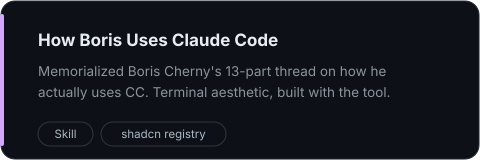</a>
<a href="https://x.com/Daniel_An23/status/2011481601050349793">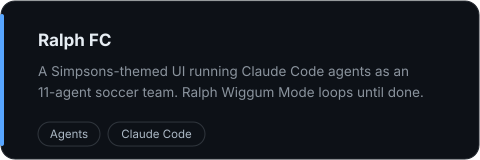</a>
<a href="https://skarnfall.com">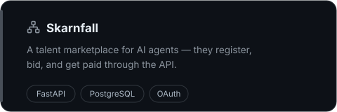</a>
<a href="https://x.com/Daniel_An23/status/2006427824832352701">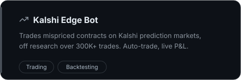</a>
<a href="https://justfuckinguseclaudecode.com">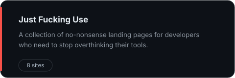</a>
</div>

## 🧭 Professional Journey

<kbd>&nbsp;2022&nbsp;–&nbsp;2024&nbsp;</kbd> &nbsp;**Microsoft** — AI/Web3 partnerships that got [TechCrunch](https://techcrunch.com/2023/08/09/microsoft-aptos-blockchain-ai-web3/) and [Blockworks](https://blockworks.co/news/microsoft-axelar-team-up) coverage<br/><br/>
<kbd>&nbsp;2021&nbsp;–&nbsp;2022&nbsp;</kbd> &nbsp;**Mozilla** — Open web advocacy before it was cool. Kind of.<br/><br/>
<kbd>&nbsp;2009&nbsp;–&nbsp;2021&nbsp;</kbd> &nbsp;**Google** — ~12 years · authored their most-read Think with Google article; mobile web performance research that influenced search ranking<br/><br/>
<kbd>&nbsp;2008&nbsp;–&nbsp;2009&nbsp;</kbd> &nbsp;**Executive Search** — headhunter during the '08 financial crisis. Now I'm building AI to automate it.<br/><br/>
<kbd>&nbsp;2006&nbsp;–&nbsp;2008&nbsp;</kbd> &nbsp;**Barclays Global Investors** — Institutional BD: Active Equity, Fixed Income, Hedge Funds<br/><br/>
<kbd>&nbsp;earlier&nbsp;</kbd> &nbsp;**Wellington Management** · Business Analyst &nbsp;—&nbsp; **Banc of America Securities** · FX Sales &amp; Trading (London) &nbsp;—&nbsp; **Putnam Lovell Securities** · FIG M&amp;A (London)

## 📦 Open Source

<div align="center">
<a href="https://github.com/carolinacherry/compare-mcp">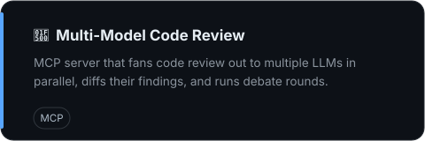</a>
<a href="https://github.com/carolinacherry/github-talent-mcp">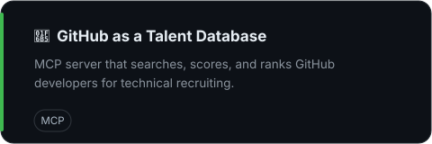</a>
<a href="https://github.com/carolinacherry/local-ai">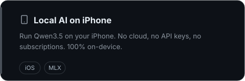</a>
<a href="https://github.com/carolinacherry/magnus">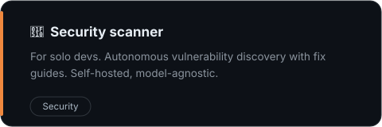</a>
<a href="https://github.com/carolinacherry/qwen-fine-tuned-career-advisor">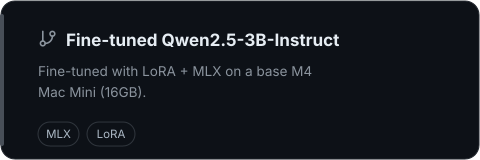</a>
<a href="https://github.com/quant-sentiment-ai/claude-equity-research">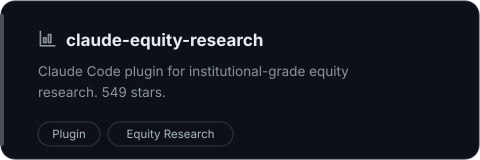</a>
</div>

---

<div align="center">

🌐 <a href="https://danielan.io">danielan.io</a> · 💼 <a href="https://linkedin.com/in/andaniel">LinkedIn</a> · 𝕏 <a href="https://x.com/Daniel_An23">@Daniel_An23</a>

<a href="https://buymeacoffee.com/danielan"></a>

[](https://github.com/carolinacherry)

</div>
